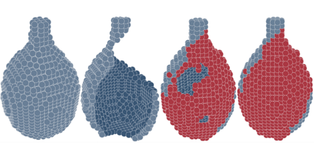

# 3D-ORGAN
3D Object Reconstruction Generative Adversarial Network

Code for paper ["3D Reconstruction of Incomplete Archaeological Objects Using a Generative Adversarial Network"](https://dl.acm.org/doi/abs/10.1145/3208159.3208173)
[[arxiv]](https://arxiv.org/abs/1711.06363).



## Citation

Please use the following bibtex entry:
```bibtex
@inproceedings{10.1145/3208159.3208173,
author = {Hermoza, Renato and Sipiran, Ivan},
title = {3D Reconstruction of Incomplete Archaeological Objects Using a Generative Adversarial Network},
year = {2018},
isbn = {9781450364010},
publisher = {Association for Computing Machinery},
address = {New York, NY, USA},
url = {https://doi.org/10.1145/3208159.3208173},
doi = {10.1145/3208159.3208173},
booktitle = {Proceedings of Computer Graphics International 2018},
pages = {5–11},
numpages = {7},
keywords = {3D Reconstruction, Adversarial Learning, Shape Completion},
location = {Bintan, Island, Indonesia},
series = {CGI 2018}
}
```
